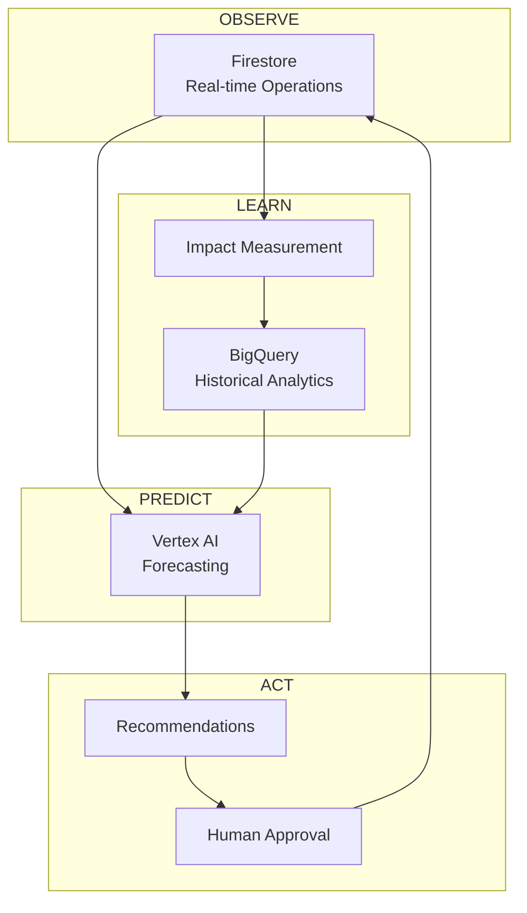
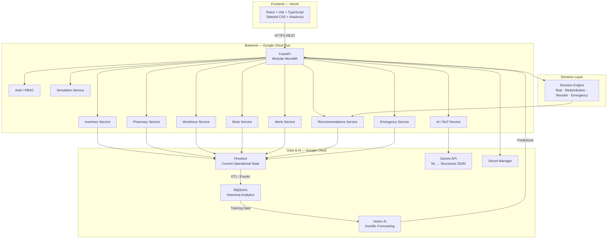
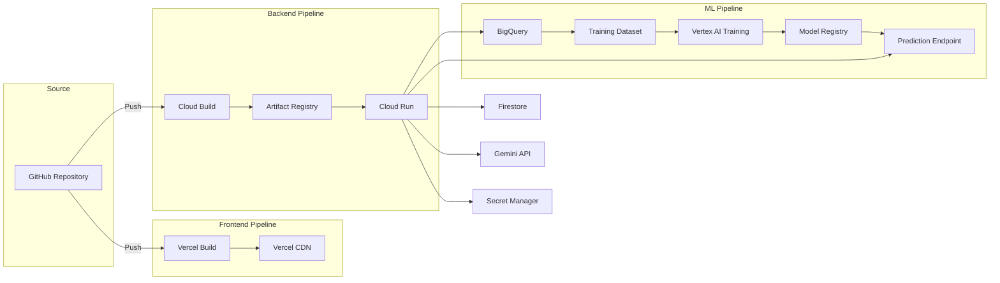

# System Architecture — ThetaHealth AI

## Overview

ThetaHealth AI is an AI-powered healthcare operations intelligence and resilience platform. The architecture is built around three conceptual layers and a generative AI interface, deployed on managed serverless Google Cloud infrastructure.

> **Design Principle:** Modular monolith. No Kubernetes. No unnecessary microservices. Easy to develop, test, demonstrate, and deploy.

---

## 1. Architectural Layers

| Layer | System | Question It Answers |
|---|---|---|
| **Layer 1 — Operational Truth** | Firebase Firestore | "What is happening now?" |
| **Layer 2 — Historical Intelligence** | Google BigQuery | "What has happened?" |
| **Layer 3 — Predictive Intelligence** | Google Vertex AI | "What is likely to happen next?" |
| **Intelligence Interface** | Gemini API | "How can humans communicate with and understand the system?" |

---

## 2. High-Level Architecture



---

## 3. Cloud Architecture



---

## 4. Data Flow Patterns

### 4.1 Operational Updates (Real-Time)

```
PHC Worker → FastAPI → Firestore → Firestore Listener → React Dashboard
```

### 4.2 Analytics Pipeline

```
Firestore → ETL / Event → BigQuery
```

### 4.3 ML Pipeline

```
BigQuery → Vertex AI → Predictions → FastAPI → Firestore → Dashboard
```

### 4.4 NLP Pipeline (Theta Voice)

```
Voice → Browser Transcription → Text → FastAPI → Gemini → Structured JSON
→ Pydantic Validation → Business Rules → Entity Resolution
→ Human Confirmation → Firestore
```

### 4.5 AI Validation Pipeline (Strict)

Gemini output is **never** written directly to Firestore.

```
Gemini → JSON Schema → Pydantic → Business Rules → Entity Resolution → Human Confirmation → Firestore
```

---

## 5. Firestore Architecture

Firestore is the source of truth for **current operational state**.

### Top-Level Collections

```
countries/{countryId}
states/{stateId}
districts/{districtId}
facilities/{facilityId}
users/{userId}
medicines/{medicineId}
suppliers/{supplierId}
emergencies/{emergencyId}
alerts/{alertId}
recommendations/{recommendationId}
```

### Facility Subcollections

```
facilities/{facilityId}/inventory
facilities/{facilityId}/beds
facilities/{facilityId}/staff
facilities/{facilityId}/attendance
facilities/{facilityId}/transactions
facilities/{facilityId}/shipments
```

### Required Fields (Every Record)

```
created_at, updated_at, created_by, facility_id, source
```

---

## 6. BigQuery Architecture

BigQuery stores **immutable historical analytical data**. Never overwrite history.

### Tables

| Table | Purpose |
|---|---|
| `medicine_consumption` | Daily/hourly consumption events |
| `inventory_history` | Inventory snapshots over time |
| `patient_footfall` | Patient visit counts by facility |
| `bed_occupancy` | Bed utilization history |
| `staff_attendance` | Attendance records |
| `shipment_history` | Shipment tracking and delivery |
| `emergency_events` | Emergency declarations and resolutions |
| `forecast_results` | Vertex AI forecast outputs |
| `stockout_predictions` | Predicted stock-out events |
| `recommendations` | AI recommendations and outcomes |

---

## 7. AI / ML Architecture

### 7.1 Gemini (Generative AI)

**Purpose:** Natural-language understanding, structured extraction, AI explanations.

**Used for:**
- PHC voice/text reports → structured JSON
- ThetaBrief executive summaries
- Ask Theta (AI Copilot) natural-language queries
- Scenario explanations
- AI explainability narratives

**NOT used for:** Authoritative numerical facts. All operational facts come from Firestore/BigQuery/backend tools.

### 7.2 Vertex AI (Predictive ML)

**Purpose:** AutoML forecasting and prediction.

**Used for:**
- Medicine demand forecasting (7/14/30 days)
- Stock-out prediction
- Bed demand forecasting
- Workforce demand forecasting
- Anomaly detection
- Model evaluation and registry

**Features for forecasting:**
- Historical consumption, patient footfall, seasonality
- Facility, district, medicine category, day-of-week
- Emergency events, historical demand trends

### 7.3 Decision Engine

Backend optimization engine combining:
- Current inventory + forecast demand
- Minimum stock levels + facility priority
- Distance + transportation availability
- Expiry dates + emergency severity + supplier ETA

Outputs **recommendations**, never autonomous actions.

---

## 8. Backend Architecture

```
backend/
├── app/
│   ├── main.py
│   ├── api/              # FastAPI route handlers
│   ├── services/         # Business logic
│   ├── repositories/     # Firestore / BigQuery data access
│   ├── schemas/          # Pydantic models (request/response)
│   ├── models/           # Domain models
│   ├── ai/               # Gemini integration
│   ├── ml/               # Vertex AI integration
│   ├── rules/            # Configurable business rules
│   ├── security/         # Auth, RBAC, token verification
│   ├── events/           # Event processing, ETL triggers
│   └── utils/            # Helpers, constants
├── tests/
├── Dockerfile
└── requirements.txt
```

**Pattern:** `API → Service → Repository → Firestore / BigQuery / External API`

---

## 9. Frontend Architecture

```
frontend/src/
├── app/                  # App entry, providers, routing
├── components/
│   ├── ui/               # shadcn/ui base components
│   ├── charts/           # Recharts wrappers
│   ├── maps/             # MapLibre GL components
│   ├── tables/           # Data table components
│   └── ai/               # AI-specific UI (confidence, confirmation)
├── features/
│   ├── command-center/   # National dashboard
│   ├── facilities/       # Facility management
│   ├── inventory/        # Inventory views
│   ├── pharmacy/         # Pharmacy intelligence
│   ├── beds/             # Bed management
│   ├── workforce/        # Staff & attendance
│   ├── supply-chain/     # Control tower, resource exchange
│   ├── emergency/        # Emergency mode
│   ├── alerts/           # Alert management
│   ├── simulator/        # What-if simulator
│   └── copilot/          # Ask Theta
├── hooks/                # Custom React hooks
├── services/             # API client functions
├── schemas/              # Zod validation schemas
├── types/                # TypeScript type definitions
├── lib/                  # Utility functions
└── routes/               # Route definitions
```

**Rule:** No business logic inside UI components.

---

## 10. API Design

### Core Endpoints

```
GET    /api/v1/facilities
GET    /api/v1/facilities/{id}

GET    /api/v1/inventory
POST   /api/v1/inventory/transactions
GET    /api/v1/inventory/critical
GET    /api/v1/inventory/expiring

GET    /api/v1/beds
GET    /api/v1/staff
GET    /api/v1/attendance

GET    /api/v1/alerts

GET    /api/v1/forecasts/medicine
GET    /api/v1/forecasts/beds
GET    /api/v1/forecasts/workforce

GET    /api/v1/recommendations
POST   /api/v1/recommendations/{id}/approve
POST   /api/v1/recommendations/{id}/reject

POST   /api/v1/ai/parse-report
POST   /api/v1/ai/copilot

GET    /api/v1/resilience/{facilityId}

POST   /api/v1/simulation/start
POST   /api/v1/simulation/stop

POST   /api/v1/emergencies
GET    /api/v1/emergencies
```

FastAPI auto-generates OpenAPI documentation at `/docs`.

---

## 11. Security Architecture

### Authentication
- Firebase Authentication (Email/Password, Google, GitHub)
- Firebase ID tokens verified server-side via `firebase-admin` SDK

### Authorization (RBAC)
- Role-based access enforced in FastAPI `Depends()` dependencies
- Users see only data appropriate to their role and organizational scope
- Frontend route protection is supplementary, not primary

### Data Privacy
- Synthetic data for hackathon
- Minimum necessary data principle
- Role-based access, audit logs, pseudonymization
- Aggregated data on national dashboards (no patient-level info)
- Encrypted communication, secrets management via GCP Secret Manager

---

## 12. Deployment Architecture



### Frontend — Vercel
Environment variables: `VITE_API_BASE_URL`, `VITE_FIREBASE_*` keys.

### Backend — Google Cloud Run
Dockerized FastAPI. Environment variables via Secret Manager: `GOOGLE_CLOUD_PROJECT`, `FIREBASE_PROJECT_ID`, `VERTEX_AI_LOCATION`, `BIGQUERY_DATASET`, `GEMINI_API_KEY`.

### Observability
- Cloud Logging, Cloud Monitoring, Error Reporting
- Tracked: API latency, Gemini latency/failures, Firestore errors, BigQuery jobs, Vertex AI prediction latency, AI extraction confidence

---

## 13. Offline / Low-Connectivity Support

PHCs may have unreliable connectivity. Design principles:

- Important reports are queued locally (IndexedDB)
- Queued reports sync automatically when connectivity returns
- UI clearly indicates offline state and sync status

---

## 14. Federated Architecture (Future)

```
                GLOBAL MODEL
                     │
      ┌──────────────┼──────────────┐
      ▼              ▼              ▼
    INDIA          BRAZIL       SOUTH AFRICA
     NODE            NODE            NODE
      │              │              │
  Local Data      Local Data      Local Data
```

For MVP: clean country boundaries, separated operational data from model-sharing interfaces, model interfaces designed for future federated training. No complex federated-learning infrastructure.

---

## 15. Performance Principles

- Fast dashboard loading with lazy-loaded charts
- Firestore real-time listeners for operational updates
- Pagination and server-side aggregation
- BigQuery for analytical queries only (not per-interaction)
- Pre-aggregated analytics for dashboards
- Efficient Gemini calls, batch processing for ML
- Caching where appropriate

---

## 16. Cost-Efficient Infrastructure

All managed serverless:

| Service | Purpose |
|---|---|
| Vercel | Frontend CDN |
| Cloud Run | Backend compute |
| Firestore | Operational database |
| BigQuery | Analytics warehouse |
| Vertex AI | ML training & prediction |
| Cloud Storage | Assets & model artifacts |
| Secret Manager | Credentials |

No Kubernetes, VM clusters, Redis, or complex message brokers unless clearly needed.
